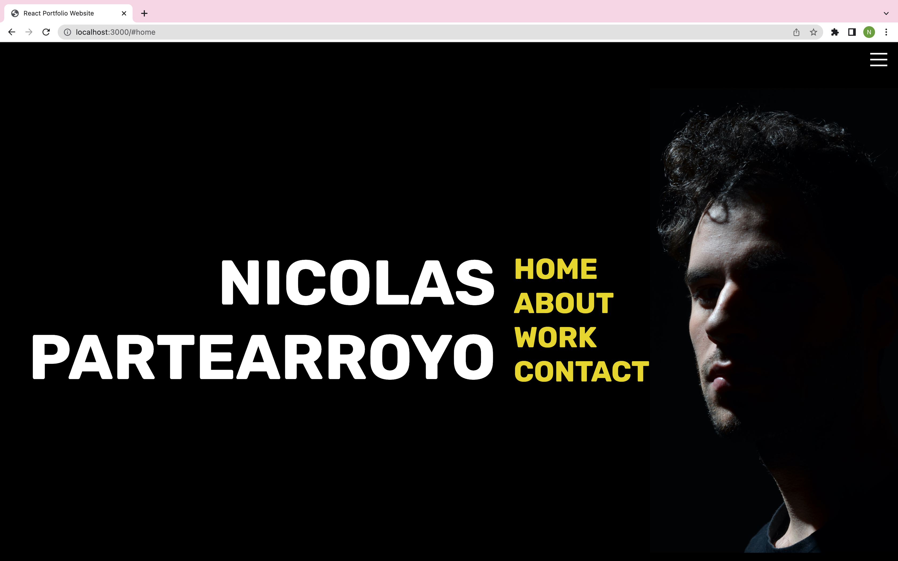

# Portfolio

I built this project using React, node.js, express.js, nodemailer, scss, github and netifly.

## Website

http://nicolaspartearroyo.netlify.app/

### `npm start`

Runs the app in the development mode.\
Open [http://localhost:3000](http://localhost:3000) to view it in your browser.

The page will reload when you make changes.\
You may also see any lint errors in the console.

### `node server.js`

Put on server.js file your email address and password on lines 16/17 and destination email on line 35 and save it before you launch node server.js (be sure to be on ./src folder.\

### Preview

